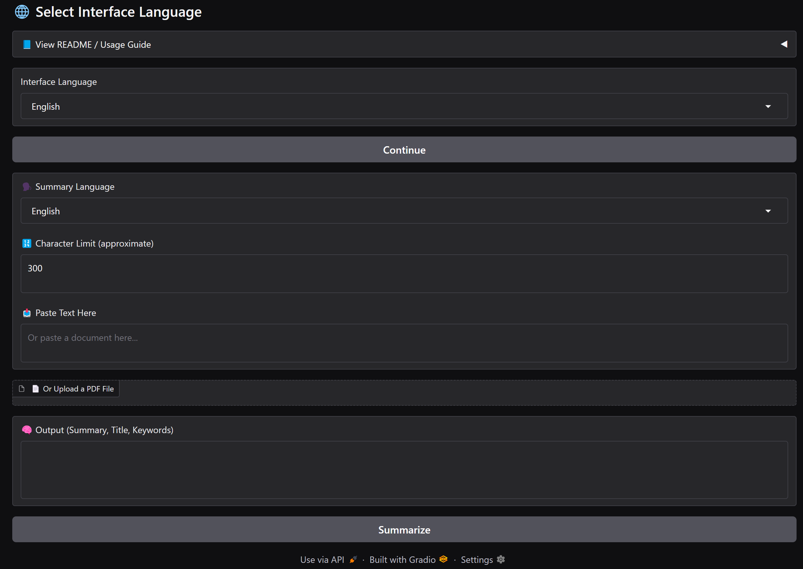

# Multilingual-Summarizer
# 🧠 Multilingual Text & PDF Summarizer with GPT-3.5

**Live Demo:** [Hugging Face Space](https://huggingface.co/spaces/Talip7/multilingual-summarizer)  
**Author:** [Talip7](https://huggingface.co/Talip7)

---

## 🚀 Overview

This application allows users to **upload a PDF file or paste any text**, select the desired summary language, and instantly receive:

- 📄 A clear, concise **summary**  
- 🏷️ An auto-generated **title**  
- 🔑 **5 relevant keywords**

All powered by **OpenAI's GPT-3.5 model** and a user-friendly, multilingual Gradio interface.

---

## 🧰 Features

- **PDF & Text Input:** Supports both direct text and PDF file uploads (Unicode-friendly, multi-language)
- **Multilingual Output:** Choose summary language — currently supports English, Turkish, Arabic, French, German, Spanish
- **Interface Language Selector:** The UI adapts to your chosen language
- **Auto-Translation:** If your input and summary language differ, the app will auto-translate before summarizing
- **Custom Output Length:** Set your desired summary length (character count)
- **Robust Error Handling:** Feedback for unreadable PDFs, empty files, etc.



---

## 📝 How To Use

1. **Select your interface language**  
2. **Click "Continue"** to access the summarization tools  
3. **Choose summary language**  
4. **Set the character limit** for the summary  
5. **Paste your text** or **upload a PDF file**  
6. **Click "Summarize"** and view your results: summary, title, and keywords

---

## ⚙️ Technologies Used

- [Gradio](https://gradio.app/) – UI and workflow
- [pdfplumber](https://github.com/jsvine/pdfplumber) – PDF text extraction
- [OpenAI GPT-3.5](https://platform.openai.com/docs) – Natural language processing

---

## 🛠️ Installation

```bash
git clone https://github.com/7Talip/multilingual-summarizer.git
cd multilingual-summarizer
pip install -r requirements.txt

